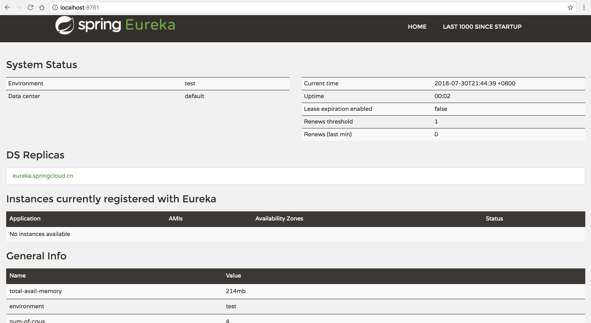

SpringCloud打造微服务平台--概览
----

# 简述

## ScpringCloud是什么

### Spring Boot和SpringCloud是什么关系

* Spring Boot是Spring的一套快速WEB开发的脚手架，可建立独立的Spring应用程序，无代码生成和xml配置、自动配置Spring、内嵌Servlet容器。Spring Boot使用了默认大于配置的理念，很多集成方案已经帮你选择好了，能不配置就不配置。可以基于Spring Boot快速开发单个微服务。

* Spring Cloud是一个基于Spring Boot实现的云应用开发工具。Spring Cloud很大的一部分是基于Spring Boot来实现。Spring Boot专注于快速、方便集成的单个个体，Spring Cloud是关注全局的服务治理框架；

spring -> spring booot -> spring cloud 这样的关系。

[官网](http://projects.spring.io/spring-cloud)

### SpringCloud架构

### 组件概览

### 组件简介

* 注册中心：

spring-cloud-eureka

spring-cloud-zookeeper

spring-cloud-consul

* 配置中心： 

spring-cloud-config

* 服务容错：

spring-cloud-netflix-hystrix

* API网关：

spring-cloud-gateway

spring-cloud-netfilx-zuul

* 服务调用：

spring-cloud-openfeign

spring-cloud-netflix-ribbon

* 消息队列：

spring-cloud-stream --> rabbitmq、kafka

spring-cloud-bus

* 链路跟踪：

spring-cloud-sletuh --> zipkin server

* 任务调度：

spring-cloud-task

* 安全认证： 

spring-cloud-security	

spring-cloud-vault	

* 测试管理：

spring-cloud-contract	

# 组件介绍

## 注册中心

### Why？

微服务架构中，应用被拆分众多的小应用服务，应该规模变大，服务实例的数量是动态变化，为了为客户端能够访问到服务，就必须要有一种服务的发现机制，完成服务的登记注册、监控管理、服务发现，服务间的调用管理等功能。

### What？

有两种主要的服务发现方式：客户端发现（client-side discovery）和服务器端发现（server-side discovery）。Eureka是客户端发现模式。

Spring Cloud Eureka由两个组件组成：Eureka服务器和Eureka客户端。

Eureka Client连接到Eureka Server，并维持心跳连接。这样系统的维护人员就可以通过 Eureka Server 来监控系统中各个微服务是否正常运行。基本的结构如下图。

另外Eurekag还提供了web的管理界面，运维人员可以查看各微服务的情况

## 配置中心

### Why？

在微服务架构中，每个微服务节点都有相关的配置数据项。当节点众多，维护就变得非常困难，因此需要建立一个中心配置服务，所有配置都放在配置中心统一管理。

### What？

Spring Cloud Config由两个组件组成：Config服务器和Config客户端。应用启动时，将相关配置项拉取到本地缓存使用，配置更新时也可由配置中心主动推送到应用节点(后续会详细讲解）。他支持git、svn、file方式存储配置。

## 消息中心

### Why？

消息总线是为了实现企业应该数据共享和集成，提供一种基于企业服务总线的信息共享交换平台。具有松散耦合的特点，实现了"集中式管理、分布式运行"的工作模式。

在微服务架构中，服务众多，各服务又有很多的调用和被调用关系。消息总线就是为了解决在某些非同步场景下，服务间强解藕、数据交换量巨大的解决方案。

### What？

Spring Cloud Bus 将分布式的节点用轻量的消息代理连接起来。它可以用于广播配置文件的更改或者服务之间的异步通讯，也可以用于监控。可以说，消息总线是微服务应用扩展“道路”上的推进器，而且也把它用来作应用间相互通信的消息管道。

## 服务网关

### Why？

在微服务架构中，后端服务往往不直接开放给调用端，而是通过一个API网关根据请求的url，路由到相应的服务。当添加API网关后，在第三方调用端和服务提供方之间就创建了一面墙，这面墙直接与调用方通信进行权限控制、限流、排队，过载保护、请求合并、裁剪、黑白名单、异常用户过滤拦截等等。

### What？

Spring Cloud Gateway是一个构建在Spring 生态之上的高性能、非阻塞API网关，包括：Spring 5，Spring Boot 2和Project Reactor。

## 服务调用

### Why？

负载均衡可分为服务端负载均衡和客户端负载均衡，服务端负载均衡完全由服务器处理，客户端不需要做任何事情。而客户端负载均衡技术，客户端需要维护一组服务器引用，每次客户端向服务端发请求的时候，会根据算法主动选中一个服务节点。常用的负载均衡算法有：随机、轮询、权重、负载、Hash等。

### What？

Spring Cloud Ribbon是一个基于客户端的负载均衡器，Feign内部也已经使用了Ribbon。

Spring Cloud Feign是一个声明式的Web Service客户端，它的目的就是让Web Service调用更加简单。Feign提供了HTTP请求的模板，通过编写简单的接口和插入注解，就可以定义好HTTP请求的参数、格式、地址等信息。而Feign则会完全代理HTTP请求，我们只需要像调用方法一样调用它就可以完成服务请求及相关处理。

Feign整合了Ribbon和Hystrix（见下节），可以让我们不再需要显式地使用这两个组件，大大简化了服务调用。

## 服务容错

### Why？

在分布式架构中，一个应用依赖多个服务是非常常见的，如果其中一个依赖由于延迟过高发生阻塞，调用该依赖服务的线程就会阻塞，如果相关业务的QPS较高，就可能产生大量阻塞，从而导致该应用/服务由于服务器资源被耗尽而拖垮。

另外，故障也会在应用之间传递，如果故障服务的上游依赖较多，可能会引起服务的雪崩效应。就跟数据瘫痪，会引起依赖该数据库的应用瘫痪是一样的道理。

所以，断路器就是用来支持服务隔离、熔断等操作的工具。断路器会以隔离的方式来处理服务请求，当断路数量达到阈值，就会触发熔断（直接返回失败）。

### What？

Spring Cloud Hystrix微服务架构中提供服务隔离、熔断、降级机制的工具/框架。通过以上手段来降低服务故障带来的关联影响，以提高系统的整体可用性。

* 断路器与各服务的关系

* 断路器的原理

## 授权与认证

### Why？

在 Web 应用开发中，安全一直是非常重要的一个方面。安全虽然属于应用的非功能性需求，但是应该在应用开发的初期就考虑进来。如果在应用开发的后期才考虑安全的问题，就可能陷入一个两难的境地：一方面，应用存在严重的安全漏洞，无法满足用户的要求，并可能造成用户的隐私数据被攻击者窃取；另一方面，应用的基本架构已经确定，要修复安全漏洞，可能需要对系统的架构做出比较重大的调整，因而需要更多的开发时间，影响应用的发布进程。因此，从应用开发的第一天就应该把安全相关的因素考虑进来，并在整个应用的开发过程中。

### What？

Spring Cloud Security是基于Spring的企业应用系统提供声明式的安全访问控制解决方案的安全框架。它提供全面的安全性解决方案，同时在Web请求级和方法调用级处理身份确认和授权。他是灵活和强大的身份验证和访问控制框架，以确保基于Spring的Java Web应用程序的安全。

>OAuth2.0授权框架使第三方应用程序来获取对HTTP服务的有限访问机会。无论是通过编排资源所有者和HTTP服务之间的交互批准的资源所有者，或通过允许第三方应用程序来获取自己的访问权限。

例如某网站/app以微信、qq登陆方式就是OAuth2方式。

Spring Security Oauth2是建立在spring security的基础之上，符合OAuth2标准的开源实现。

OAuth2定义了4种模式，共有4个角色，具体内容可以查看另外的介绍 

[Spring Security OAuth2简介与实施](https://gitee.com/toopoo/SpringCloud/blob/master/auth/readme.md)

