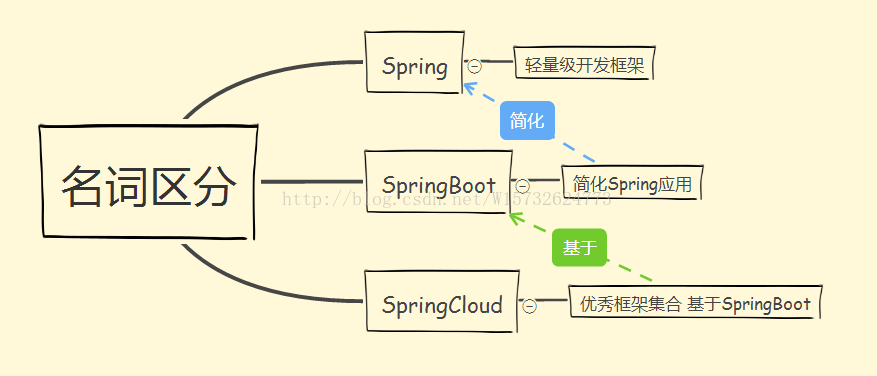
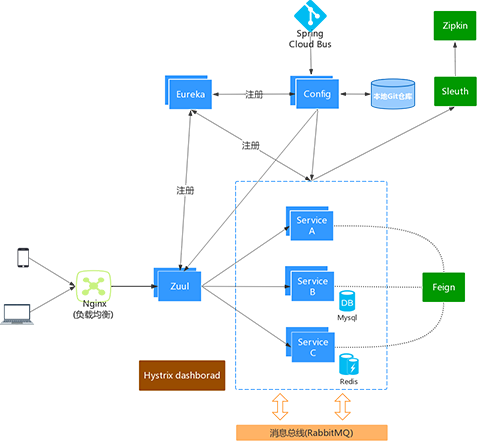
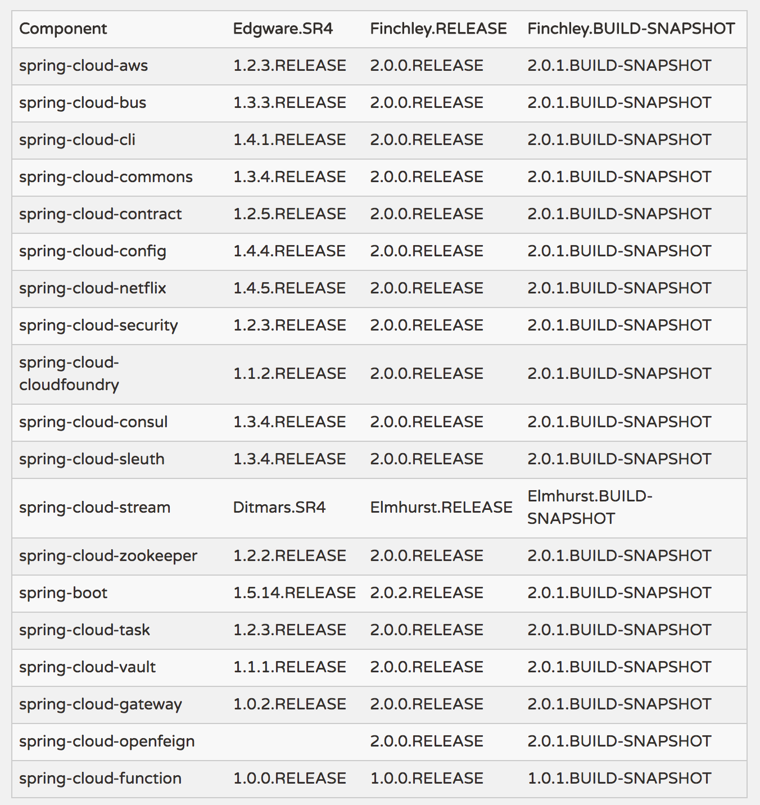
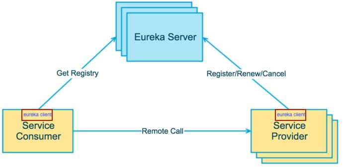
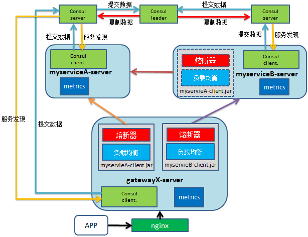

SpringCloud打造微服务平台--简介
----

# 简述

## ScpringCloud是什么

### Spring Boot和SpringCloud是什么关系

* Spring Boot是Spring的一套快速WEB开发的脚手架，可建立独立的Spring应用程序，无代码生成和xml配置、自动配置Spring、内嵌Servlet容器。Spring Boot使用了默认大于配置的理念，很多集成方案已经帮你选择好了，能不配置就不配置。可以基于Spring Boot快速开发单个微服务。

* Spring Cloud是一个基于Spring Boot实现的云应用开发工具。Spring Cloud很大的一部分是基于Spring Boot来实现。Spring Boot专注于快速、方便集成的单个个体，Spring Cloud是关注全局的服务治理框架；

spring -> spring booot -> spring cloud 这样的关系。

[官网](http://projects.spring.io/spring-cloud)

### SpringCloud架构

### 组件概览

### 组件简介

* 注册中心：

spring-cloud-eureka

spring-cloud-consul

spring-cloud-zookeeper

* 配置中心： 

spring-cloud-config

* 集群容错：

spring-cloud-hystrix

* API网关：

spring-cloud-gateway

spring-cloud-zuul

* 服务调用：

spring-cloud-openfeign

spring-cloud-ribbon

* 消息队列：

spring-cloud-stream --> rabbitmq、kafka

* 分布式锁：

spring-data-redis

* 链路跟踪：

spring cloud sletuh --> zipkin server

任务管理：

spring-cloud-task

安全认证： 

spring-cloud-oauth2/JWT

服务管理：

spring-boot-admin

# 微服务开发

## 注册中心

## 配置中心

## 消息中心

## 服务网关

## 服务调用

## 服务容错

## 授权与认证

# 微服务发布

## 服务打包

## 服务部署

# 微服务运维

## 监控中心

## 调度中心

## 追踪中心