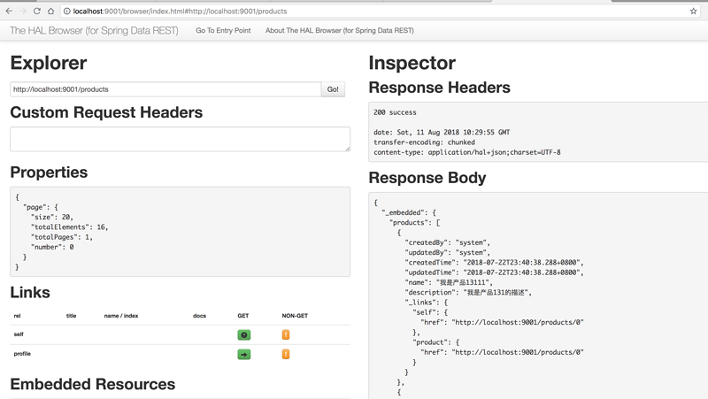

使用SpringDataREST快速构建HAL风格的Restful应用
-------

## 前言

### RESTFUL API简介

>REST（英文：Representational State Transfer，简称REST）描述了一个架构样式的网络系统，比如 web 应用程序。它首次出现在 2000 年 Roy Fielding 的博士论文中，他是 HTTP 规范的主要编写者之一。在目前主流的三种Web服务交互方案中，REST相比于SOAP（Simple Object Access protocol，简单对象访问协议）以及XML-RPC更加简单明了，无论是对URL的处理还是对Payload的编码，REST都倾向于用更加简单轻量的方法设计和实现。值得注意的是REST并没有一个明确的标准，而更像是一种设计的风格。

常用的HTTP动词有下面五个（括号里是对应的SQL命令）。

GET（SELECT） ：从服务器取出资源（一项或多项）。
POST（CREATE）：在服务器新建一个资源。
PUT（UPDATE） ：在服务器更新资源（客户端提供改变后的完整资源）。
PATCH（UPDATE） ：在服务器更新资源（客户端提供改变的属性）。
DELETE（DELETE）：从服务器删除资源。
HEAD：获取资源的元数据。
OPTIONS：获取信息，关于资源的哪些属性是客户端可以改变的。

* REST 成熟度模型。

该模型把 REST 服务按照成熟度划分成 4 个层次：

1. 第一个层次（Level 0）的 Web 服务只是使用 HTTP 作为传输方式，实际上只是远程方法调用（RPC）的一种具体形式。SOAP 和 XML-RPC 都属于此类。
2. 第二个层次（Level 1）的 Web 服务引入了资源的概念。每个资源有对应的标识符和表达。
3. 第三个层次（Level 2）的 Web 服务使用不同的 HTTP 方法来进行不同的操作，并且使用 HTTP 状态码来表示不同的结果。如 HTTP GET 方法来获取资源，HTTP DELETE 方法来删除资源。
4. 第四个层次（Level 3）的 Web 服务使用 HATEOAS。在资源的表达中包含了链接信息。客户端可以根据链接来发现可以执行的动作。

### RESTFUL URL命名原则

**API URI 设计最重要的一个原则： nouns (not verbs!) ，名词（而不是动词）。**

CRUD 简单例子：

|  方法   | URL       |       功能       |
|--------|-----------|------------------|
| GET    | /users    | 获取用户列表       |
| GET    | /users/1  | 获取 id 为 1 的用户|
| POST   | /users    | 创建一个用户       |
| PUT    | /users/1  | 替换 id 为 1 的用户|
| PATCH  | /users/1  | 修改 id 为 1 的用户|
| DELETE | /users/1  | 删除 id 为 1 的用户|

上面是对某一种资源进行操作的 URI，那如果是有关联的资源，或者称为级联的资源，该如何设计 URI 呢？比如某一用户下的产品：

|  方法   | URL                 |             功能                   |
|--------|---------------------|------------------------------------|
| GET    | /users/1/products   | 获取 Id 为 1 用户下的产品列表         |
| GET    | /users/1/products/2 | 获取 Id 为 1 用户下 Id 为 2 的产品    |
| POST   | /users/1/products   | 在 Id 为 1 用户下，创建一个产品       |
| PUT    | /users/1/products/2 | 在 Id 为 1 用户下，替换 Id 为 2 的产品|
| PATCH  | /users/1/products/2 | 修改 Id 为 1 的用户下 Id 为 2 的产品  |
| DELETE | /users/1/products/2 | 删除 Id 为 1 的用户下 Id 为 2 的产品  |

### HAL风格REST

>HAL（Hypertxt Application Language）是一个被广泛采用的超文本表达的规范。应用可以考虑遵循该规范。

规范事例（查询列表）如下：
```json
{
    "_links": {
        "self": {
            "href": "http://localhost:8080/lists"
        }
    }, 
    "_embedded": {
        "lists": [
            {
                "id": 1, 
                "name": "Default", 
                "_links": {
                    "todo:items": {
                        "href": "http://localhost:8080/lists/1/items"
                    }, 
                    "self": {
                        "href": "http://localhost:8080/lists/1"
                    }, 
                    "curies": [
                        {
                            "href": "http://www.midgetontoes.com/todolist/rels/{rel}", 
                            "name": "todo", 
                            "templated": true
                        }
                    ]
                }
            }
        ]
    }
}

```

目前github提供的api就是这种风格。在返回结果中添加额外的信息（链接）之后，服务器端提供的表达可以帮助客户端更好的发现服务器端所支持的动作。

在具体的表达中，应用虽然可以根据需要选择最适合的格式，但是在表达的基本结构上应该遵循一定的规范，这样可以保证最大程度的适用性。

## Spring Data REST简介

**什么是Spring Data REST**

>Spring Data REST是基于Spring Data的repository之上，可以把 repository 自动输出为REST资源，目前支持Spring Data JPA、Spring Data MongoDB、Spring Data Neo4j、Spring Data GemFire、Spring Data Cassandra的 repository 自动转换成REST服务，注意是自动。

简单点说，Spring Data REST把我们需要编写的大量REST模版接口做了自动化实现，并符合HAL的规范.

## 实现

本例子使用Jpa来实现数据库的操作，具体实现请点击 [例子仓库](https://gitee.com/toopoo/SpringCloud/tree/master/services/producer-jpa)查看

### 依赖

pom.xml加入
```xml
<!--Spring Data Rest-->
<dependency>
    <groupId>org.springframework.boot</groupId>
    <artifactId>spring-boot-starter-data-rest</artifactId>
</dependency>
<!--Spring Data Hal测试工具-->
<dependency>
    <groupId>org.springframework.data</groupId>
    <artifactId>spring-data-rest-hal-browser</artifactId>
</dependency>
```

### 开发

* 定义实体类

Product.java
```java
package com.springboot.services.producer.jpa.entity.po;

import lombok.AllArgsConstructor;
import lombok.Builder;
import lombok.Data;
import lombok.NoArgsConstructor;

import javax.persistence.*;

@Data
@Entity
@Builder
@NoArgsConstructor
@AllArgsConstructor
public class Product extends JpaBasePo {

    @Id
    @GeneratedValue(strategy = GenerationType.IDENTITY)
    private Long id;

    @Column(nullable = false)
    private String name;

    @Column
    private String description;
}
```

* 定义Dao类

ProductMapper.java
```java
package com.springboot.services.producer.jpa.dao;

import com.springboot.services.producer.jpa.entity.po.Product;
import org.springframework.data.repository.PagingAndSortingRepository;
import org.springframework.data.rest.core.annotation.RepositoryRestResource;

@RepositoryRestResource
public interface ProductMapper extends PagingAndSortingRepository<Product, Long> {
}
```

### 配置

```yaml
spring:
  jpa:
    show-sql: true
    generate-ddl: true
```

就是这样我们就已经提供了一个关于prodcut的rest api，简单的增、删、改、查都有了。连Controller都不用写，spring已经实现了。

## 测试

### 启动服务

启动命令：`mvn springboot:run`

* api首页：`curl -i -X GET http://localhost:9001/`
站点首页列出了所有的api列表，目前一个products，为`http://localhost:9001/products{?page,size,sort}`查询产品列表的url，客户端根据url导航就可以进一步的调用api。

`http://localhost:9001/profile`可以获取api的原数据。

```json
{
  "_links" : {
    "products" : {
      "href" : "http://localhost:9001/products{?page,size,sort}",
      "templated" : true
    },
    "profile" : {
      "href" : "http://localhost:9001/profile"
    }
  }
}
```

* 查询列表：`curl -i -X GET  http://localhost:9001/products`
```json
{
  "_embedded" : {
    "products" : [ {
      "createdBy" : "system",
      "updatedBy" : "system",
      "createdTime" : "2018-07-22T23:40:38.288+0800",
      "updatedTime" : "2018-07-22T23:40:38.288+0800",
      "name" : "我是产品13111",
      "description" : "我是产品131的描述",
      "_links" : {
        "self" : {
          "href" : "http://localhost:9001/products/1"
        },
        "product" : {
          "href" : "http://localhost:9001/products/1"
        }
      }
    },{}]
  },
  "_links" : {
    "self" : {
      "href" : "http://localhost:9001/products{?page,size,sort}",
      "templated" : true
    },
    "profile" : {
      "href" : "http://localhost:9001/profile/products"
    }
  },
  "page" : {
    "size" : 20,
    "totalElements" : 16,
    "totalPages" : 1,
    "number" : 0
  }
}    
```

* 查询单个实体：`curl -i -X GET http://localhost:9001/products/1`
```json
{
  "createdBy" : "system",
  "updatedBy" : "system",
  "createdTime" : "2018-07-22T23:40:38.288+0800",
  "updatedTime" : "2018-07-22T23:40:38.288+0800",
  "name" : "我是产品13111",
  "description" : "我是产品131的描述",
  "_links" : {
    "self" : {
      "href" : "http://localhost:9001/products/0"
    },
    "product" : {
      "href" : "http://localhost:9001/products/0"
    }
  }
}
```

* 删除：`curl -i -X DELETE http://localhost:9001/products/0`

* 修改：`curl -i -X PUT -H Content-Type:application/json -d '{"name":"产品1"}' http://localhost:9001/products/0`

```json
{
  "createdBy" : "system",
  "updatedBy" : "system",
  "createdTime" : "2018-08-11T19:29:45.755+0800",
  "updatedTime" : "2018-08-11T19:29:45.755+0800",
  "name" : "产品1",
  "description" : null,
  "_links" : {
    "self" : {
      "href" : "http://localhost:9001/products/0"
    },
    "product" : {
      "href" : "http://localhost:9001/products/0"
    }
  }
}
```

* 新增：`curl -i -X POST -H Content-Type:application/json -d '{"name":"产品1"}'  http://localhost:9001/products`
```json
{
  "createdBy" : "system",
  "updatedBy" : "system",
  "createdTime" : "2018-08-11T19:24:33.072+0800",
  "updatedTime" : "2018-08-11T19:24:33.072+0800",
  "name" : "产品1",
  "description" : "desc",
  "_links" : {
    "self" : {
      "href" : "http://localhost:9001/products/10"
    },
    "product" : {
      "href" : "http://localhost:9001/products/10"
    }
  }
}
```

### 启动浏览器访问

url：`http://localhost:9001/browser/index.html#/`



