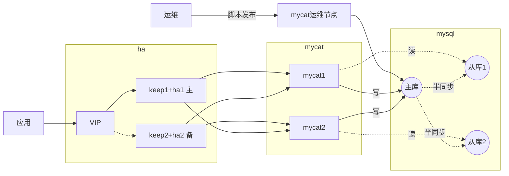

# centos下搭建mycat高可用(keepalived+haproxy)集群

[toc]

## mycat简介

​    MyCat是一个开源的分布式数据库系统，是一个实现了MySQL协议的服务器，前端用户可以把它看作是一个数据库代理，用MySQL客户端工具和命令行访问，而其后端可以用MySQL原生协议与多个MySQL服务器通信，也可以用JDBC协议与大多数主流数据库服务器通信，其核心功能是分表分库，即将一个大表水平分割为N个小表，存储在后端MySQL服务器里或者其他数据库里。

​    MyCat发展到目前的版本，已经不是一个单纯的MySQL代理了，它的后端可以支持MySQL、SQL Server、Oracle、DB2、PostgreSQL等主流数据库，也支持MongoDB这种新型NoSQL方式的存储，未来还会支持更多类型的存储。而在最终用户看来，无论是那种存储方式，在MyCat里，都是一个传统的数据库表，支持标准的SQL语句进行数据的操作，这样一来，对前端业务系统来说，可以大幅降低开发难度，提升开发速度

​    具体介绍请参考： [mycat官方网站](http://mycat.io/)

## 环境准备

OS: CentOS Linux release 7.2.1511 (Core)

| 序号 | 主机   | IP          | 部署内容                                             |
| ---- | ------ | ----------- | ---------------------------------------------------- |
| 1    | mycat1 | 10.9.37.226 | mycat节点，使用xinetd进行mycat运行状态监测           |
| 2    | mycat2 | 10.9.18.108 | mycat节点，使用xinetd进行mycat运行状态监测           |
| 3    | keep1  | 10.9.71.4   | 部署keepalived + haproxy，主节点                     |
| 4    | keep2  | 10.9.3.180  | 部署keepalived + haproxy，备节点                     |
| 5    | VIP    | 10.9.78.178 | 准备一个同网段未被占用的ip地址用作VIP                |
| 6    | mysql  | 10.9.54.71  | 准备一个可用的mysql库，并且创建两个database(db1,db2) |

## 架构图



## mycat搭建

### java安装

```bash
# 安装jdk1.8：
yum install -y java-1.8.0-openjdk.x86_64
# 验证java是否安装成功：
java -version
```

### mycat安装

```bash
# 创建软件存放目录
mkdir /var/workspace/
cd /var/workspace/
# 下载mycat
wget http://dl.mycat.io/1.6.7.4/Mycat-server-1.6.7.4-release/Mycat-server-1.6.7.4-release-20200105164103-linux.tar.gz
# 解压
tar -zxvf Mycat-server-1.6.7.4-release-20200105164103-linux.tar.gz
# 设置mycat环境变量
echo 'MYCAT_HOME=/var/workspace/mycat' >> /etc/profile
source /etc/profile
```
### mycat配置

#### 1.配置数据源

/var/workspace/mycat/conf/schema.xml中定义了后端数据源、逻辑库/表等。

dataHost：Mycat后端连接的数据库（物理库，真实的数据库），即后端数据源，可以是mysql、oracle等。

schema：逻辑库，可以看做是一个或多个后端数据库集群构成的逻辑库。

dataNode：数据分片，逻辑库的构成，即一个逻辑库可能分为多个分片，数据分片最终会落在一个或多个物理库。

如下配置有一个dataHost对应后端一个mysql实例，mysql创建了两个database，db1和db2。一个逻辑库sbux中有一张sbux_users逻辑表，表中的数据分为2片，分别落在db1和db2上。

```xml
<?xml version="1.0"?>
<!DOCTYPE mycat:schema SYSTEM "schema.dtd">
<mycat:schema xmlns:mycat="http://io.mycat/">
        <schema name="sbux" checkSQLschema="true" sqlMaxLimit="100" randomDataNode="dn1">
                <!-- auto sharding by id (long) -->
                <!--splitTableNames 启用<table name 属性使用逗号分割配置多个表,即多个表使用这个配置-->
                <table name="sbux_users" dataNode="dn1,dn2" rule="auto-sharding-long" splitTableNames ="true"/>
        </schema>
        <!-- <dataNode name="dn1$0-743" dataHost="localhost1" database="db$0-743"/> -->
        <dataNode name="dn1" dataHost="mysql1" database="db1" />
        <dataNode name="dn2" dataHost="mysql1" database="db2" />
        <!--<dataNode name="dn3" dataHost="mysql1" database="sbux" />-->
        <dataHost name="mysql1" maxCon="1000" minCon="10" balance="0" writeType="0" dbType="mysql" dbDriver="native" switchType="1"  slaveThreshold="100">
                <heartbeat>select user()</heartbeat>
                <!-- can have multi write hosts -->
                <writeHost host="hostM1" url="10.9.54.71:3306" user="sbux_app" password="Abc@12345"></writeHost>
                <!-- <writeHost host="hostM2" url="localhost:3316" user="root" password="123456"/> -->
        </dataHost>
</mycat:schema>
```

以上配置中schema sbux使用了auto-sharding-long分片策略，分片策略在/var/workspace/mycat/conf/rule.xml中定义，如下

```xml
<tableRule name="auto-sharding-long">
  <rule>
    <columns>id</columns>
    <algorithm>rang-long</algorithm>
  </rule>
</tableRule>
<function name="rang-long" class="io.mycat.route.function.AutoPartitionByLong">
  <!--使用区间分片，即按数值的范围路由数据，如0-500在第一个分片，500-100在第二个分片-->
  <property name="mapFile">autopartition-long.txt</property>
</function>
```

该配置中指定了autopartition-long.txt文件为策略记录，选择的策略是按数值的范围路由数据，即0-500在第一个分片，500-100在第二个分片

```
# range start-end ,data node index
# K=1000,M=10000.
0-500=0
500-1000=1
```

#### 2.配置mycat用户

/var/workspace/mycat/conf/server.xml中定义mycat的系统配置和用户等。可以通过xml新增和修改mycat用户信息。

以下为schema：sbux添加了两个用户root和sbux_app，应用使用这两个账号连接mycat进行数据的操作。

```xml
<user name="root" defaultAccount="true">
  <property name="password">123456</property>
  <property name="schemas">sbux</property>
  <property name="defaultSchema">sbux</property>
  <!--No MyCAT Database selected 错误前会尝试使用该schema作为schema，不设置则为null,报错 -->
  <!-- 表级 DML 权限设置 -->
  <!--
    <privileges check="false">
      <schema name="TESTDB" dml="0110" >
        <table name="tb01" dml="0000"></table>
        <table name="tb02" dml="1111"></table>
      </schema>
    </privileges>
  -->
</user>

<user name="sbux_app">
  <property name="password">Abc@12345</property>
  <property name="schemas">sbux</property>
  <property name="readOnly">true</property>
  <property name="defaultSchema">sbux</property>
</user>
```

### mycat启动

```bash
# mycat进程启动
[root@mycat1 ~]# /var/workspace/mycat/bin/mycat start
Mycat-server is running (20658).
# mycat运行端口查看
[root@mycat1 ~]# netstat -an |grep 8066
tcp        0      0 0.0.0.0:8066            0.0.0.0:*               LISTEN
# mycat管理端口查看
[root@mycat1 ~]# netstat -an |grep 9066
tcp        0      0 0.0.0.0:9066            0.0.0.0:*               LISTEN
```

### mycat验证

使用mysql客户端连接mycat

```mysql
[root@mycat1 ~]# /var/workspace/mysql-5.7.29-linux-glibc2.12-x86_64/bin/mysql -P8066 -uroot --protocol TCP -p
Enter password:
Welcome to the MySQL monitor.  Commands end with ; or \g.
Your MySQL connection id is 187
Server version: 5.6.29-mycat-1.6.7.4-release-20200105164103 MyCat Server (OpenCloudDB)

Copyright (c) 2000, 2020, Oracle and/or its affiliates. All rights reserved.

Oracle is a registered trademark of Oracle Corporation and/or its
affiliates. Other names may be trademarks of their respective
owners.

Type 'help;' or '\h' for help. Type '\c' to clear the current input statement.

mysql> show databases;
+----------+
| DATABASE |
+----------+
| sbux     |
+----------+
1 row in set (0.00 sec)
```

### mycat管理命令

管理命令需要连接mycat的9066默认端口

```
mysql> show @@help;
+------------------------------------------------+--------------------------------------------+
| STATEMENT                                      | DESCRIPTION                                |
+------------------------------------------------+--------------------------------------------+
| show @@time.current                            | Report current timestamp                   |
| show @@time.startup                            | Report startup timestamp                   |
| show @@version                                 | Report Mycat Server version                |
| show @@server                                  | Report server status                       |
| show @@threadpool                              | Report threadPool status                   |
| show @@database                                | Report databases                           |
| show @@datanode                                | Report dataNodes                           |
| show @@datanode where schema = ?               | Report dataNodes                           |
| show @@datasource                              | Report dataSources                         |
| show @@datasource where dataNode = ?           | Report dataSources                         |
| show @@datasource.synstatus                    | Report datasource data synchronous         |
| show @@datasource.syndetail where name=?       | Report datasource data synchronous detail  |
| show @@datasource.cluster                      | Report datasource galary cluster variables |
| show @@processor                               | Report processor status                    |
| show @@command                                 | Report commands status                     |
| show @@connection                              | Report connection status                   |
| show @@cache                                   | Report system cache usage                  |
| show @@backend                                 | Report backend connection status           |
| show @@session                                 | Report front session details               |
| show @@connection.sql                          | Report connection sql                      |
| show @@sql.execute                             | Report execute status                      |
| show @@sql.detail where id = ?                 | Report execute detail status               |
| show @@sql                                     | Report SQL list                            |
| show @@sql.high                                | Report Hight Frequency SQL                 |
| show @@sql.slow                                | Report slow SQL                            |
| show @@sql.resultset                           | Report BIG RESULTSET SQL                   |
| show @@sql.sum                                 | Report  User RW Stat                       |
| show @@sql.sum.user                            | Report  User RW Stat                       |
| show @@sql.sum.table                           | Report  Table RW Stat                      |
| show @@parser                                  | Report parser status                       |
| show @@router                                  | Report router status                       |
| show @@heartbeat                               | Report heartbeat status                    |
| show @@heartbeat.detail where name=?           | Report heartbeat current detail            |
| show @@slow where schema = ?                   | Report schema slow sql                     |
| show @@slow where datanode = ?                 | Report datanode slow sql                   |
| show @@sysparam                                | Report system param                        |
| show @@syslog limit=?                          | Report system mycat.log                    |
| show @@white                                   | show mycat white host                      |
| show @@white.set=?,?                           | set mycat white host,[ip,user]             |
| show @@directmemory=1 or 2                     | show mycat direct memory usage             |
| show @@check_global -SCHEMA= ? -TABLE=? -retry=? -interval=? | check mycat global table consistency       |
| switch @@datasource name:index                 | Switch dataSource                          |
| kill @@connection id1,id2,...                  | Kill the specified connections             |
| stop @@heartbeat name:time                     | Pause dataNode heartbeat                   |
| reload @@config                                | Reload basic config from file              |
| reload @@config_all                            | Reload all config from file                |
| reload @@route                                 | Reload route config from file              |
| reload @@user                                  | Reload user config from file               |
| reload @@sqlslow=                              | Set Slow SQL Time(ms)                      |
| reload @@user_stat                             | Reset show @@sql  @@sql.sum @@sql.slow     |
| rollback @@config                              | Rollback all config from memory            |
| rollback @@route                               | Rollback route config from memory          |
| rollback @@user                                | Rollback user config from memory           |
| reload @@sqlstat=open                          | Open real-time sql stat analyzer           |
| reload @@sqlstat=close                         | Close real-time sql stat analyzer          |
| offline                                        | Change MyCat status to OFF                 |
| online                                         | Change MyCat status to ON                  |
| clear @@slow where schema = ?                  | Clear slow sql by schema                   |
| clear @@slow where datanode = ?                | Clear slow sql by datanode                 |
+------------------------------------------------+--------------------------------------------+
59 rows in set (0.00 sec)
```

### mycat调优

-Xmx1024m -Xmn512m -XX:MaxDirectMemorySize=2048m -Xss256K -XX:+UseParallelGC

### mycat监测

使用xinetd检测mycat进程是否正常，提供http接口给haproxy探测mycat运行情况。

#### 1.安装xinetd

`yum install -y xinetd`

#### 2.创建进程检测的脚本

创建/var/workspace/mycat_status 文件，内容如下：

```bash
#!/bin/bash
#/usr/local/bin/mycat_status.sh
# This script checks if a mycat server is healthy running on localhost. It will
# return:
# "HTTP/1.x 200 OK\r" (if mycat is running smoothly)
# "HTTP/1.x 503 Internal Server Error\r" (else)

mycat=`/var/workspace/mycat/bin/mycat status |grep 'not running'| wc -l`
if [ "$mycat" = "0" ];then
    /bin/echo -e "HTTP/1.1 200 OK\r\n"
else
    /bin/echo -e "HTTP/1.1 503 Service Unavailable\r\n"
fi
```

添加sh执行权限`chmod 755 /var/workspace/mycat_status`

#### 3.修改xinetd配置文件

在xinetd配置中加入mycat的信息，创建文件/etc/xinetd.d/mycat_status。在48700端口启动服务，检测mycat进程是否存在并将结果返回，具体配置如下：

```
service mycat_status
{
    flags = REUSE
    socket_type = stream
    port = 48700
    wait = no
    user = root
    server = /var/workspace/mycat_status
    log_on_failure +=USERID
    disable = no
}
```

#### 4.重启xinetd

```
[root@mycat1 ~]# systemctl restart xinetd
[root@mycat1 ~]# systemctl status xinetd
● xinetd.service - Xinetd A Powerful Replacement For Inetd
   Loaded: loaded (/usr/lib/systemd/system/xinetd.service; enabled; vendor preset: enabled)
   Active: active (running) since 日 2020-02-23 14:31:43 CST; 4 days ago
  Process: 27014 ExecStart=/usr/sbin/xinetd -stayalive -pidfile /var/run/xinetd.pid $EXTRAOPTIONS (code=exited, status=0/SUCCESS)
 Main PID: 27015 (xinetd)
   CGroup: /system.slice/xinetd.service
           └─27015 /usr/sbin/xinetd -stayalive -pidfile /var/run/xinetd.pid
```

#### 5.验证结果

```
[root@mycat1 ~]# curl -i http://localhost:48700
HTTP/1.1 200 OK
```

返回200说明mycat服务是正常的，返回503代表mycat进程停止了，服务异常。

> 备节点搭建请参考如上步骤，完全一样，这里不再重复。

## HA搭建

### 安装配置keepalived

#### 1.安装keepalived

```bash
# 使用yum安装keepalived
yum install -y keepalived
# 创建keepalived相关日志目录
mkdir -p /var/workspace/log/keepalived
```

#### 2.调整配置文件

`vim /etc/keepalived/keepalived.conf`

```bash
! Configuration File for keepalived
global_defs {
   notification_email {
     # 要通知的邮箱地址
     sysadmin@firewall.loc
   }
   # 发送的邮箱
   notification_email_from Alexandre.Cassen@firewall.loc
   smtp_server 192.168.200.1
   smtp_connect_timeout 30
   # router_id主和备不能一样
   router_id keep1
   #vrrp_skip_check_adv_addr
   #vrrp_strict
   vrrp_garp_interval 0
   vrrp_gna_interval 0
}
# 定期调用check_haproxy.sh脚本检查mycat运行状态
vrrp_script chk_http_port {
   script "/etc/keepalived/scripts/check_haproxy.sh"
   interval 2
   weight 2
}
vrrp_instance VI_1 {
    state MASTER # 备服务器用：BACKUP
    # VIP绑定的网卡
    interface eth0
    # 主备必须一样
    virtual_router_id 168
    # 备服务器priority要低于主的
    priority 200
    advert_int 1
    authentication {
        auth_type PASS
        auth_pass 1111
    }
    virtual_ipaddress {
    		# 此ip为VIP，请自行修改
        10.9.78.178/16  dev eth0 scope global 
    }
    track_script {
    		# 调用脚本 check_haproxy.sh 检查 haproxy 是否存活（mycat刚刚加的那个服务）
        chk_http_port 
    }
    # keepalived状态变化时执行相应脚本
    # 当此keepalived节点变为主时执行
    notify_master /etc/keepalived/scripts/haproxy_master.sh
    # 当此keepalived节点变为备时执行
    notify_backup /etc/keepalived/scripts/haproxy_backup.sh
    # 当此keepalived节点fault时执行
    notify_fault  /etc/keepalived/scripts/haproxy_fault.sh
    # 当此keepalived节点停止时执行
    notify_stop   /etc/keepalived/scripts/haproxy_stop.sh
}
```

#### 3.状态变化执行脚本

/etc/keepalived/scripts/haproxy_master.sh，当本节点变为主节点时调用

```shell
#!/bin/bash
STARTHAPROXY="/bin/systemctl restart haproxy"
# 检测haproxy进程已存在就kill掉
STOPHAPROXY=`ps -ef |grep /usr/sbin/haproxy | grep -v grep|awk '{print $2}'|xargs kill -s 9`
LOGFILE="/var/workspace/log/keepalived/keepalived-haproxy-state.log"

echo "[master]" >> $LOGFILE
date >> $LOGFILE
echo "Being master...." >> $LOGFILE 2>&1
echo "stop haproxy...." >> $LOGFILE 2>&1
$STOPHAPROXY >> $LOGFILE 2>&1
echo "start haproxy...." >> $LOGFILE 2>&1
$STARTHAPROXY >> $LOGFILE 2>&1
echo "haproxy stared ..." >> $LOGFILE
```

/etc/keepalived/scripts/haproxy_backup.sh，当本节点变为备节点时调用

```shell
#!/bin/bash
STARTHAPROXY="/bin/systemctl restart haproxy"
STOPHAPROXY=`ps -ef |grep /usr/sbin/haproxy | grep -v grep|awk '{print $2}'|xargs kill -s 9`
LOGFILE="/var/workspace/log/keepalived/keepalived-haproxy-state.log"

echo "[backup]" >> $LOGFILE
date >> $LOGFILE
echo "Being backup...." >> $LOGFILE 2>&1
echo "stop haproxy...." >> $LOGFILE 2>&1
$STOPHAPROXY >> $LOGFILE 2>&1
echo "start haproxy...." >> $LOGFILE 2>&1
$STARTHAPROXY >> $LOGFILE 2>&1
echo "haproxy stared ..." >> $LOGFILE
```

/etc/keepalived/scripts/haproxy_fault.sh，当fault时调用

```shell
#!/bin/bash
LOGFILE=/var/workspace/log/keepalived/keepalived-haproxy-state.log
echo "[fault]" >> $LOGFILE
date >> $LOGFILE
```

/etc/keepalived/scripts/haproxy_stop.sh，当节点停止时调用

```shell
#!/bin/bash
LOGFILE=/var/workspace/log/keepalived/keepalived-haproxy-state.log
echo "[stop]" >> $LOGFILE
date >> $LOGFILE
```

#### 4.启动keepalived

```shell
systemctl restart keepalived
```

#### 5.验证keepalived

```shell
# 查看主节点网卡上绑定的VIP
[root@keep1 ~]# ip a
1: lo: <LOOPBACK,UP,LOWER_UP> mtu 65536 qdisc noqueue state UNKNOWN qlen 1000
    link/loopback 00:00:00:00:00:00 brd 00:00:00:00:00:00
    inet 127.0.0.1/8 scope host lo
       valid_lft forever preferred_lft forever
2: eth0: <BROADCAST,MULTICAST,UP,LOWER_UP> mtu 1454 qdisc pfifo_fast state UP qlen 1000
    link/ether 52:54:00:f2:8c:e1 brd ff:ff:ff:ff:ff:ff
    inet 10.9.71.4/16 brd 10.9.255.255 scope global eth0
       valid_lft forever preferred_lft forever
    inet 10.9.78.178/16 scope global secondary eth0
       valid_lft forever preferred_lft forever
# 查看主节点vrrp组播
[root@keep1 ~]# tcpdump -i eth0 -n -p vrrp
tcpdump: verbose output suppressed, use -v or -vv for full protocol decode
listening on eth0, link-type EN10MB (Ethernet), capture size 262144 bytes
23:08:54.298521 IP 10.9.71.4 > 224.0.0.18: VRRPv2, Advertisement, vrid 168, prio 200, authtype simple, intvl 1s, length 20
```

   ` inet 10.9.78.178/16 scope global secondary eth0`为keepalived新增的虚ip。

#### 6.备节点搭建

以上步骤相同，配置文件如下

```shell
! Configuration File for keepalived
global_defs {
   notification_email {
     # 要通知的邮箱地址
     sysadmin@firewall.loc
   }
   # 发送的邮箱
   notification_email_from Alexandre.Cassen@firewall.loc
   smtp_server 192.168.200.1
   smtp_connect_timeout 30
   # router_id主和备不能一样
   router_id keep2
   #vrrp_skip_check_adv_addr
   #vrrp_strict
   vrrp_garp_interval 0
   vrrp_gna_interval 0
}
# 定期调用check_haproxy.sh脚本检查mycat运行状态
vrrp_script chk_http_port {
   script "/etc/keepalived/scripts/check_haproxy.sh"
   interval 2
   weight 2
}
vrrp_instance VI_1 {
    state BACKUP # 备服务器用：BACKUP
    # VIP绑定的网卡
    interface eth0
    # 主备必须一样
    virtual_router_id 168
    # 备服务器priority要低于主的
    priority 150
    advert_int 1
    authentication {
        auth_type PASS
        auth_pass 1111
    }
    virtual_ipaddress {
    		# 此ip为VIP，请自行修改
        10.9.78.178/16  dev eth0 scope global 
    }
    track_script {
    		# 调用脚本 check_haproxy.sh 检查 haproxy 是否存活（mycat刚刚加的那个服务）
        chk_http_port 
    }
    # keepalived状态变化时执行相应脚本
    # 当此keepalived节点变为主时执行
    notify_master /etc/keepalived/scripts/haproxy_master.sh
    # 当此keepalived节点变为备时执行
    notify_backup /etc/keepalived/scripts/haproxy_backup.sh
    # 当此keepalived节点fault时执行
    notify_fault  /etc/keepalived/scripts/haproxy_fault.sh
    # 当此keepalived节点停止时执行
    notify_stop   /etc/keepalived/scripts/haproxy_stop.sh
}
```

### 安装配置haproxy

#### 1.安装haproxy

```
yum install -y haproxy
```

#### 2.修改haproxy的配置文件

/etc/haproxy/haproxy.cfg

```nginx
#---------------------------------------------------------------------
# Global settings
#---------------------------------------------------------------------
global
    log         127.0.0.1 local0
    chroot      /var/lib/haproxy
    pidfile     /var/run/haproxy.pid
    maxconn     4000
    user        haproxy
    group       haproxy
    daemon
    # turn on stats unix socket
    stats socket /var/lib/haproxy/stats
defaults
    mode                    http
    log                     global
    option                  httplog
    option                  dontlognull
    option http-server-close
    #option forwardfor       except 127.0.0.0/8
    option                  redispatch
    retries                 3
    timeout http-request    10s
    timeout queue           1m
    timeout connect         10s
    timeout client          60s
    timeout server          60s
    timeout http-keep-alive 10s
    timeout check           10s
    timeout tunnel          1h
    timeout client-fin      30s
    maxconn                 3000
# 绑定到keep1主机的本地网卡上，该页面为haproxy的统计页面，用于查看请求转发等状态
listen admin_status 0.0.0.0:48800 ##VIP
    stats uri /admin-status ##统计页面
    stats auth admin:admin
    mode http
    option httplog
# 转发到mycat 8066业务端口，服务绑定在VIP上
listen allmycat_service 10.9.78.178:8066 ##转发到 mycat 的 8066 端口，即 mycat 的服务端口
    mode tcp
    option tcplog
    option tcpka
    option httpchk OPTIONS * HTTP/1.1\r\nHost:\ www
    balance roundrobin
    server mycat_1 10.9.37.226:8066 check port 48700 inter 5s rise 2 fall 3
    server mycat_2 10.9.18.108:8066 check port 48700 inter 5s rise 2 fall 3
    timeout server 20000
# 转发到mycat 9066管理端口，服务绑定在VIP上
listen allmycat_admin 10.9.78.178:9066 ##转发到 mycat 的 9066 端口，及 mycat 的管理控制台端口
    mode tcp
    option tcplog
    option tcpka
    option httpchk OPTIONS * HTTP/1.1\r\nHost:\ www
    balance roundrobin
    # 48700为mycat主机利用xinetd提供的状态check服务，5s检查一次
    server mycat_1 10.9.37.226:9066 check port 48700 inter 5s rise 2 fall 3
    server mycat_2 10.9.18.108:9066 check port 48700 inter 5s rise 2 fall 3
    timeout server 20000
```

#### 3.启动haproxy

```
systemctl start haproxy
```

#### 4.haproxy日志记录

默认情况haproxy是不记录日志的，为了记录日志还需要配置 syslog 模块，在 linux 下是 rsyslogd 服务

```shell
yum install –y rsyslog
```


修改/etc/rsyslog.conf配置文件最后加上

```
local0.*                                                /var/log/haproxy.log
```

新增文件 /etc/rsyslog.d/haproxy.conf，内容如下

```
$ModLoad imudp
$UDPServerRun 514
local0.* /var/log/haproxy.log
```

重启

```
systemctl restart rsyslog
systemctl restart haproxy
```

查看日志 /var/log/haproxy.log

#### 5.备节点搭建

备节点搭建与主节点相同

## mycat集群验证

登陆任意同一局域网主机(需要有mysql客户端工具)

```shell
# ping VIP可以通
[root@tools ~]# ping 10.9.78.178
PING 10.9.78.178 (10.9.78.178) 56(84) bytes of data.
64 bytes from 10.9.78.178: icmp_seq=1 ttl=63 time=91.3 ms
# 查看主机的arp列表
[root@tools ~]# arp
Address                  HWtype  HWaddress           Flags Mask            Iface
10.9.78.178              ether   52:54:00:82:5e:87   C                     eth0
# 通过VIP连接到了mycat集群的管理端口
[root@tools ~]# /var/workspace/mysql-5.7.29-linux-glibc2.12-x86_64/bin/mysql -h 10.9.78.178 -P9066 -uroot -p
Enter password:
Welcome to the MySQL monitor.  Commands end with ; or \g.
Your MySQL connection id is 196
Server version: 5.6.29-mycat-1.6.7.4-release-20200105164103 MyCat Server (OpenCloudDB)

Copyright (c) 2000, 2020, Oracle and/or its affiliates. All rights reserved.

Oracle is a registered trademark of Oracle Corporation and/or its
affiliates. Other names may be trademarks of their respective
owners.

Type 'help;' or '\h' for help. Type '\c' to clear the current input statement.

# 查看mycat连接
mysql> show @@connection;
+------------+------+------------+------+------------+------+--------+---------+--------+---------+---------------+-------------+------------+---------+------------+
| PROCESSOR  | ID   | HOST       | PORT | LOCAL_PORT | USER | SCHEMA | CHARSET | NET_IN | NET_OUT | ALIVE_TIME(S) | RECV_BUFFER | SEND_QUEUE | txlevel | autocommit |
+------------+------+------------+------+------------+------+--------+---------+--------+---------+---------------+-------------+------------+---------+------------+
| Processor1 |  200 | 10.9.3.180 | 9066 |      45996 | root | NULL   | utf8:33 |    165 |     892 |            19 |        4096 |          0 |         |            |
+------------+------+------------+------+------------+------+--------+---------+--------+---------+---------------+-------------+------------+---------+------------+
1 row in set (0.00 sec)

mysql>
```

## 分库分表验证

```mysql
[root@tools ~]# /var/workspace/mysql-5.7.29-linux-glibc2.12-x86_64/bin/mysql -h 10.9.78.178 -P8066 -uroot -p
Enter password:
mysql> use sbux
Reading table information for completion of table and column names
You can turn off this feature to get a quicker startup with -A

Database changed

mysql> CREATE TABLE sbux_users (
     id BIGINT ( 20 ) NOT NULL,
     `name` VARCHAR ( 20 ) NOT NULL,
     `desc` VARCHAR ( 100 ),
     PRIMARY KEY ( id )
     ) ENGINE = INNODB DEFAULT CHARSET = utf8mb4;
Query OK, 0 rows affected (0.01 sec)

mysql> INSERT INTO sbux_users(id,`name`,`desc`) VALUES(1,'zhangs1','goods1');
Query OK, 1 row affected (0.00 sec)
mysql> INSERT INTO sbux_users(id,`name`,`desc`) VALUES(501,'zhangs501','goods501');
Query OK, 1 row affected (0.01 sec)

mysql> select * from sbux_users;
+-----+---------+--------+
| ID  | NAME    | DESC   |
+-----+---------+--------+
|   1 | zhangs1 | goods1 |
| 501 | zhangs4 | goods4 |
+-----+---------+--------+
2 rows in set (0.00 sec)
# 如下语句解析，实际发送到两个dn进行查询
mysql> explain select * from sbux_users;
+-----------+------------------------------------+
| DATA_NODE | SQL                                |
+-----------+------------------------------------+
| dn1       | SELECT * FROM sbux_users LIMIT 100 |
| dn2       | SELECT * FROM sbux_users LIMIT 100 |
+-----------+------------------------------------+
2 rows in set (0.00 sec)
# 根据分片键精准定位到dn1
mysql> explain select * from sbux_users where id =1;
+-----------+-------------------------------------------------+
| DATA_NODE | SQL                                             |
+-----------+-------------------------------------------------+
| dn1       | SELECT * FROM sbux_users WHERE id = 1 LIMIT 100 |
+-----------+-------------------------------------------------+
1 row in set (0.00 sec)
# 根据分片键精准定位到dn2
mysql> explain select * from sbux_users where id =501;
+-----------+---------------------------------------------------+
| DATA_NODE | SQL                                               |
+-----------+---------------------------------------------------+
| dn2       | SELECT * FROM sbux_users WHERE id = 501 LIMIT 100 |
+-----------+---------------------------------------------------+
1 row in set (0.00 sec)
```


