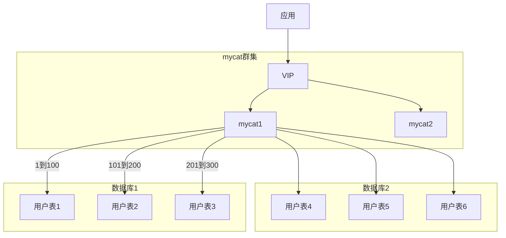

# 数据库开发维护手册

[toc]

## 账号管理

为了更好的对数据库用户管控和安全审计的需要及安全运维，有必要对数据库用户权限分级，实施用户架构规范。

实施中必须遵循的主要原则有：

1.  用户的权限授予本着权限最小化原则进行。
2. 数据库用户授权范围（登陆数据库的ip段）采用最小授权。
3. 同一用户不能同时被多人使用。
4. 多个账号不能使用同一密码。
5. 密码要求至少8位，由必须包含数字、大写字母、小写字母。
6. 表属主用户必须和、应用、运维用户分离，以防表结构的误修改等。
7. 运维用户必须实行实名制

### 账号分类

| 角色         | 账号名      | 权限                                     | 权限范围   | 用途                                                         |
| ------------ | ----------- | ---------------------------------------- | ---------- | ------------------------------------------------------------ |
| 应用账号     | 应用名_app  | 数据增删改查                             | 被授权表   | 主要用于应用访问数据库进行业务交易                           |
| 数据属主账号 | 应用名_data | 对象创建、修改、删除、查看，数据增删改查 | 被授权对象 | 用于建立和维护系统自身主要的数据库对象，如表、视图等，以及这些对象的授权动作。 |
| 查询账号     | 应用名_qry  | 表的查询权限                             | 被授权对象 | 主要用于生产环境问题和故障排查，只可浏览有权限的表的数据。   |
| 运维账号     | 应用名_ops  | 创建、删除表，授权表查询权限             | 被授权对象 | 主要用户日常运维，运维人员进行数据管理，如导入导出等。       |
| 数据库管理员 | dba         | 创建数据库、删除等所有对象权限           | 所有对象   | 用于管理库数据，可远程登陆                                   |
| 超级管理员   | root        | 所有权限                                 | 所有对象   | 不能远程登陆，即只可在数据库安装机器上（即localhost）本地登陆 |
| 数据同步账号 | slave       | 对像创建、修改、删除、查看               | 所有对象   | 用于从库同步主库对象及数据，禁止人工使用该账号登陆           |
|              |             |                                          |            |                                                              |

> 为避免账号过长，应用名使用缩写代替。

### 常用权限

| **权限**                | **权限级别**           | **权限说明**                                                 |
| ----------------------- | ---------------------- | ------------------------------------------------------------ |
| CREATE                  | 数据库、表或索引       | 创建数据库、表或索引权限                                     |
| DROP                    | 数据库或表             | 删除数据库或表权限                                           |
| GRANT OPTION            | 数据库、表或保存的程序 | 赋予权限选项                                                 |
| REFERENCES              | 数据库或表             |                                                              |
| ALTER                   | 表                     | 更改表，比如添加字段、索引等                                 |
| DELETE                  | 表                     | 删除数据权限                                                 |
| INDEX                   | 表                     | 索引权限                                                     |
| INSERT                  | 表                     | 插入权限                                                     |
| SELECT                  | 表                     | 查询权限                                                     |
| UPDATE                  | 表                     | 更新权限                                                     |
| CREATE VIEW             | 视图                   | 创建视图权限                                                 |
| SHOW VIEW               | 视图                   | 查看视图权限                                                 |
| ALTER ROUTINE           | 存储过程               | 更改存储过程权限                                             |
| CREATE ROUTINE          | 存储过程               | 创建存储过程权限                                             |
| EXECUTE                 | 存储过程               | 执行存储过程权限                                             |
| FILE                    | 服务器主机上的文件访问 | 文件访问权限                                                 |
| CREATE TEMPORARY TABLES | 服务器管理             | 创建临时表权限                                               |
| LOCK TABLES             | 服务器管理             | 锁表权限                                                     |
| CREATE USER             | 服务器管理             | 创建用户权限                                                 |
| PROCESS                 | 服务器管理             | 查看进程权限                                                 |
| RELOAD                  | 服务器管理             | 执行flush-hosts, flush-logs, flush-privileges, flush-status, flush-tables, flush-threads, refresh, reload等命令的权限 |
| REPLICATION CLIENT      | 服务器管理             | 复制权限                                                     |
| REPLICATION SLAVE       | 服务器管理             | 复制权限                                                     |
| SHOW DATABASES          | 服务器管理             | 查看数据库权限                                               |
| SHUTDOWN                | 服务器管理             | 关闭数据库权限                                               |
| SUPER                   | 服务器管理             | 执行kill线程权限                                             |

## DBA指南

### 连接库

```shell
# 登陆连接mysql
[log@mysql1 ~]# mysql -h数据库ip -P端口号 -u 账号 -p
Enter password:
mysql> 
```

### 库管理

```mysql
# 查看库列表
mysql> show databases;
# 查看建库语句
mysql> show create database 库名;
# 使用数据库
mysql> use 库名;
# 查看库中的表
mysql> show tables;
# 查看建表语句
mysql> show create table 表名;
# 查看表结构
mysql> desc 表名;
# 创建库
mysql> CREATE DATABASE 库名 DEFAULT CHARSET utf8mb4;
# 删除库
mysql> DROP DATABASE 库名 ;
# 重命名库
mysql> RENAME DATABASE 旧库名 TO 新库名;
```

### 账号管理

```mysql
# 创建账号并授权
mysql> GRANT SELECT,INSERT,UPDATE,DELETE,CREATE,DROP,ALTER ON 数据库名.对象名 TO '账号'@'主机' IDENTIFIED BY '密码'
# 刷新权限
mysql> FLUSH PRIVILEGES;
# 修改密码
mysql> SET PASSWORD FOR '账号'@'主机' = PASSWORD('密码明文');
# 删除账号
mysql> DROP USER '账号'@'主机';
```

基本账号创建脚本

```mysql
CREATE USER sbux_assert_app IDENTIFIED BY 'Abc@12345';
GRANT SELECT,INSERT,UPDATE,DELETE ON 数据库名.表名 TO sbux_assert_app;

CREATE USER sbux_assert_ops IDENTIFIED BY 'Abc@12345';
GRANT SELECT,INSERT,UPDATE,DELETE,CREATE ON 数据库名.表名 TO sbux_assert_ops

CREATE USER sbux_assert_qry IDENTIFIED BY 'Abc@12345';
GRANT SELECT ON 数据库名.表名 TO sbux_assert_qry;

CREATE USER sbux_assert_data IDENTIFIED BY 'Abc@12345';
GRANT ALL PRIVILEGES ON 数据库名.* TO sbux_assert_data WITH GRANT OPTION;

CREATE USER dba IDENTIFIED BY 'Abc@12345';
GRANT ALL PRIVILEGES ON *.* TO dba WITH GRANT OPTION;
```

## 开发指南

### 数据类型

#### 数字

| 类型         | 大小                                     | 范围（有符号）                                               | 范围（无符号）                                               | 用途            |
| :----------- | :--------------------------------------- | :----------------------------------------------------------- | :----------------------------------------------------------- | :-------------- |
| TINYINT      | 1 字节                                   | (-128，127)                                                  | (0，255)                                                     | 小整数值        |
| SMALLINT     | 2 字节                                   | (-32 768，32 767)                                            | (0，65 535)                                                  | 大整数值        |
| MEDIUMINT    | 3 字节                                   | (-8 388 608，8 388 607)                                      | (0，16 777 215)                                              | 大整数值        |
| INT或INTEGER | 4 字节                                   | (-2 147 483 648，2 147 483 647)                              | (0，4 294 967 295)                                           | 大整数值        |
| BIGINT       | 8 字节                                   | (-9,223,372,036,854,775,808，9 223 372 036 854 775 807)      | (0，18 446 744 073 709 551 615)                              | 极大整数值      |
| FLOAT        | 4 字节                                   | (-3.402 823 466 E+38，-1.175 494 351 E-38)，0，(1.175 494 351 E-38，3.402 823 466 351 E+38) | 0，(1.175 494 351 E-38，3.402 823 466 E+38)                  | 单精度 浮点数值 |
| DOUBLE       | 8 字节                                   | (-1.797 693 134 862 315 7 E+308，-2.225 073 858 507 201 4 E-308)，0，(2.225 073 858 507 201 4 E-308，1.797 693 134 862 315 7 E+308) | 0，(2.225 073 858 507 201 4 E-308，1.797 693 134 862 315 7 E+308) | 双精度 浮点数值 |
| DECIMAL      | 对DECIMAL(M,D) ，如果M>D，为M+2否则为D+2 | 依赖于M和D的值                                               | 依赖于M和D的值                                               | 小数值          |

#### 日期和时间 

| 类型      | 大小 (字节) | 范围                                                         | 格式                | 用途             |
| :-------- | :---------- | :----------------------------------------------------------- | :------------------ | :--------------- |
| DATE      | 3           | 1000-01-01/9999-12-31                                        | YYYY-MM-DD          | 日期值           |
| TIME      | 3           | '-838:59:59'/'838:59:59'                                     | HH:MM:SS            | 时间值或持续时间 |
| YEAR      | 1           | 1901/2155                                                    | YYYY                | 年份值           |
| DATETIME  | 8           | 1000-01-01 00:00:00/9999-12-31 23:59:59                      | YYYY-MM-DD HH:MM:SS | 混合日期和时间值 |
| TIMESTAMP | 4           | 1970-01-01 00:00:00/2038结束时间是第 **2147483647** 秒，北京时间 **2038-1-19 11:14:07**，格林尼治时间 2038年1月19日 凌晨 03:14:07 | YYYYMMDD HHMMSS     | 混合日期和时间   |

#### 字符串

| 类型       | 大小                | 用途                            |
| :--------- | :------------------ | :------------------------------ |
| CHAR       | 0-255字节           | 定长字符串                      |
| VARCHAR    | 0-65535 字节        | 变长字符串                      |
| TINYBLOB   | 0-255字节           | 不超过 255 个字符的二进制字符串 |
| TINYTEXT   | 0-255字节           | 短文本字符串                    |
| BLOB       | 0-65 535字节        | 二进制形式的长文本数据          |
| TEXT       | 0-65 535字节        | 长文本数据                      |
| MEDIUMBLOB | 0-16 777 215字节    | 二进制形式的中等长度文本数据    |
| MEDIUMTEXT | 0-16 777 215字节    | 中等长度文本数据                |
| LONGBLOB   | 0-4 294 967 295字节 | 二进制形式的极大文本数据        |
| LONGTEXT   | 0-4 294 967 295字节 | 极大文本数据                    |

#### 其它类型

见：https://dev.mysql.com/doc/refman/5.7/en/data-types.html

> 5.7版本支持了JSON类型，可将json存入数据库，方便字段扩展。

### 脚本开发

#### DDL操作

```mysql
-- 表名：网关路由表
-- 用途：用于网关的路由...
-- 日期：2020-02-06
CREATE TABLE gateway_route
(
    id           VARCHAR(20) PRIMARY KEY COMMENT 'id',
    route_id     VARCHAR(50) NOT NULL COMMENT '路由id',
    uri          VARCHAR(100) NOT NULL COMMENT 'uri路径',
    description  VARCHAR(500) COMMENT '描述',
    status       VARCHAR(1)            DEFAULT 'Y' COMMENT '状态：Y-有效，N-无效',
    created_date DATETIME     NOT NULL DEFAULT now() COMMENT '创建时间',
    updated_date DATETIME     NOT NULL DEFAULT now() COMMENT '更新时间',
    created_by   VARCHAR(50) NOT NULL COMMENT '创建人',
    updated_by   VARCHAR(50) NOT NULL COMMENT '更新人'
) ENGINE=InnoDB DEFAULT CHARSET=utf8mb4 COMMENT '网关路由表';
```

#### DML操作

```mysql
-- DML初始数据
-- 路由数据
INSERT INTO gateway_route (id, route_id, uri, description, status, created_date, updated_date, created_by, updated_by)
VALUES
(101,
 'authorization-server',
 'lb://authorization-server:8000',
 '授权认证服务网关注册',
 'Y', now(), now(), 'system', 'system'),
```

### 分库分表



#### 分库分表策略

| 分片策略      | 优势                                         | 劣势                                     | 备注                     |
| ------------- | -------------------------------------------- | ---------------------------------------- | ------------------------ |
| 枚举值分片    | 易扩容，容易增加新枚举节点                   | 数据分布可能不均衡                       | 如地域、品类等           |
| 数值范围分片  | 易扩容，容易增加新范围节点                   | 数据分布可能不均衡，数据热点             | 如id、数值的范围         |
| 范围分组求模  | 范围内分布均衡，易扩容                       |                                          | 按范围求分片组，组内求模 |
| 取模分片      | 数据分布较均衡                               | 事务一致性难度增大，扩容需全节点数据迁移 | 分片的表字段求模         |
| 取模范围      | 可控制每片大小                               |                                          | 先求模再按范围分片       |
| 字符取模范围  |                                              |                                          |                          |
| 固定分片 hash | 灵活定义分片数据量                           | 事务一致性难度大，扩容需全节点数据迁移   | 二进制求模               |
| 一致性hash    | 效解决了分布式数据的扩容，扩容需少量数据迁移 |                                          |                          |
| 冷热数据分片  |                                              |                                          |                          |
| 应用指定分片  | 应用灵活指定                                 | 应用复杂度变高                           | 由应用传参指定分片       |
| 日期(天)分片  |                                              |                                          |                          |
| 自然月分片    |                                              | 数据分布不均衡，热点问题                 |                          |
| 日期范围 hash | 范围内数据分布均衡                           |                                          |                          |
| 单月小时分片  |                                              |                                          |                          |
| 有状态分片    | 支持自动数据迁移                             | 需要在表上增加slot字段，侵入性强         | crc32slot                |
|               |                                              |                                          |                          |

## 运维指南

### 数据库与脚本部署

运维人员连接运维专用mycat节点，进行DDL和DML的执行部署，若新建库操作步骤台下

#### 1.创建数据库

首先需要在mysql中创建数据库，分别登陆两台mysql创建

```mysql
mysql1:  CREATE DATABASE sbux_cac1 DEFAULT CHARSET utf8mb4;
mysql2:  CREATE DATABASE sbux_cac2 DEFAULT CHARSET utf8mb4;
```

#### 2.配置mycat

1.修改mycat config目录下schema.xml文件

```xml
<?xml version="1.0"?>
<!DOCTYPE mycat:schema SYSTEM "schema.dtd">
<mycat:schema xmlns:mycat="http://io.mycat/">
        <schema name="sbux_cac" checkSQLschema="true" sqlMaxLimit="100" randomDataNode="dn1">
                <!-- auto sharding by id (long) -->
                <!--splitTableNames 启用<table name 属性使用逗号分割配置多个表,即多个表使用这个配置-->
                <table name="sbux_users" dataNode="dn1,dn2" rule="auto-sharding-long" splitTableNames ="true"/>
        </schema>
        <!-- <dataNode name="dn$0-743" dataHost="localhost1" database="db$0-743"/> -->
        <dataNode name="dn1" dataHost="mysql1" database="sbux_cac1" />
        <dataNode name="dn2" dataHost="mysql2" database="sbux_cac2" />
        <!--<dataNode name="dn3" dataHost="mysql1" database="sbux" />-->
        <dataHost name="mysql1" maxCon="1000" minCon="10" balance="0" writeType="0" dbType="mysql" dbDriver="native" switchType="1"  slaveThreshold="100">
                <heartbeat>select user()</heartbeat>
                <!-- can have multi write hosts -->
                <writeHost host="hostM1" url="10.9.54.71:3306" user="sbux_app" password="Abc@12345"></writeHost>
                <!-- <writeHost host="hostM2" url="localhost:3316" user="root" password="123456"/> -->
        </dataHost>
        <dataHost name="mysql2" maxCon="1000" minCon="10" balance="0" writeType="0" dbType="mysql" dbDriver="native" switchType="1"  slaveThreshold="100">
                <heartbeat>select user()</heartbeat>
                <!-- can have multi write hosts -->
                <writeHost host="hostM1" url="10.9.54.71:3306" user="sbux_app" password="Abc@12345"></writeHost>
                <!-- <writeHost host="hostM2" url="localhost:3316" user="root" password="123456"/> -->
        </dataHost>
</mycat:schema>
```

2.修改完成后重启mycat `mycat restart`

#### 3.创建表

登陆mycat执行建表语句，mycat会分别在两个数据库中创建相应的表结构。

```mysql
mysql> CREATE TABLE sbux_users (
     id BIGINT (20) NOT NULL,
     `name` VARCHAR (20) NOT NULL,
     `desc` VARCHAR (100),
     PRIMARY KEY ( id )
     ) ENGINE = INNODB DEFAULT CHARSET = utf8mb4;
Query OK, 0 rows affected (0.01 sec)
```

> 如只新建表，则只需要在步骤2中schema节点下添加table信息，再执行脚本即可。

### 表数据导入导出

```shell
# 数据导出
mysqldump -h 数据库ip -P端口号 -u 用户名 -p 数据库名 > 导出的文件名
mysqldump -h 数据库ip -P端口号 -u 用户名 -p 数据库名 表名> 导出的文件名
# 数据导入
mysql> source 文件路径;
```
