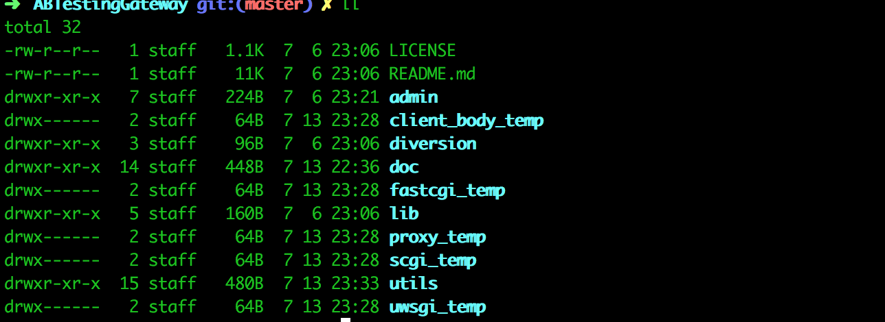

Mac下使用ABTestingGateway快速搭建灰度网关
------------

## ABTestingGateway简介

>
ABTestingGateway 是新浪开源的一个可以动态设置分流策略的灰度发布系统，工作在7层，基于nginx和ngx-lua开发，使用 redis 作为分流策略数据库，可以实现动态调度功能。
>
nginx是目前使用较多的7层服务器，可以实现高性能的转发和响应；ABTestingGateway 是在 nginx 转发的框架内，在转向 upstream 前，根据 用户请求特征 和 系统的分流策略 ，查找出目标upstream，进而实现分流。


## 环境搭建

### 1.安装openresty

> 其是由Nginx核心加很多第三方模块组成，其最大的亮点是默认集成了Lua开发环境，使得Nginx可以作为一个Web Server使用。借助于Nginx的事件驱动模型和非阻塞IO，可以实现高性能的Web应用程序。而且OpenResty提供了大量组件如Mysql、Redis、Memcached等等，使在Nginx上开发Web应用更方便更简单。目前在京东如实时价格、秒杀、动态服务、单品页、列表页等都在使用Nginx+Lua架构，其他公司如淘宝、去哪儿网等。

安装命令：`brew install openresty`

brew默认将openresty安装在`/usr/local/Cellar/openresty/`目录下

### 2.安装luajit

> JIT = Just In Time即时编译，是动态编译的一种形式，是一种优化虚拟机运行的技术。 
程序运行通常有两种方式，一种是静态编译，一种是动态解释，即时编译混合了这二者。Java和.Net/mono中都使用了这种技术。

安装命令：`brew install LuaJIT`

brew默认将openresty安装在`/usr/local/Cellar/luajit/`目录下

### 3.安装redis

安装命令：`brew install redis`

启动命令：`brew services start redis`

## ABTestingGateway搭建

### 项目下载：

命令：`git clone https://github.com/CNSRE/ABTestingGateway.git`

下载后目录结果如下



repo中的utils/conf文件夹中有灰度系统部署所需的最小示例

### 运行灰度网关

```
1. 进入ABTestingGateway目录
2. 创建logs目录，mkdir logs
3. 启动redis
4. 
# 启动upstream server，其中stable为默认upstream
4. /usr/local/Cellar/openresty/1.13.6.2/nginx/sbin/nginx -p `pwd` -c conf/stable.conf
5. /usr/local/Cellar/openresty/1.13.6.2/nginx/sbin/nginx -p `pwd` -c conf/beta1.conf
6. /usr/local/Cellar/openresty/1.13.6.2/nginx/sbin/nginx -p `pwd` -c conf/beta2.conf
7. /usr/local/Cellar/openresty/1.13.6.2/nginx/sbin/nginx -p `pwd` -c conf/beta3.conf
8. /usr/local/Cellar/openresty/1.13.6.2/nginx/sbin/nginx -p `pwd` -c conf/beta4.conf

# 启动灰度系统，proxy server，灰度系统的配置也写在conf/nginx.conf中
9. /usr/local/Cellar/openresty/1.13.6.2/nginx/sbin/nginx -p `pwd` -c conf/nginx.conf

```

### 简单验证：添加分流策略组

```
$ curl 127.0.0.1:8080/ab_admin?action=policygroup_set -d '{"1":{"divtype":"uidsuffix","divdata":[{"suffix":"1","upstream":"beta1"},{"suffix":"3","upstream":"beta2"},{"suffix":"5","upstream":"beta1"},{"suffix":"0","upstream":"beta3"}]},"2":{"divtype":"arg_city","divdata":[{"city":"BJ","upstream":"beta1"},{"city":"SH","upstream":"beta2"},{"city":"XA","upstream":"beta1"},{"city":"HZ","upstream":"beta3"}]},"3":{"divtype":"iprange","divdata":[{"range":{"start":1111,"end":2222},"upstream":"beta1"},{"range":{"start":3333,"end":4444},"upstream":"beta2"},{"range":{"start":7777,"end":2130706433},"upstream":"beta2"}]}}'

{"desc":"success ","code":200,"data":{"groupid":0,"group":[0,1,2]}}
```
#### 分流规则简介

* ABTestingGateway灰度系统目前支持的策略有ip段分流、用户uid段分流、uid尾数分流、uid白名单分流
* 优先级由数字表示，从1开始，级别为1的策略优先级最高

以下共添加了3个分流规则，分别是用户uid尾数分流、城市分流、ip段分流，具体请看json中的注释
stable服务为默认的，未匹配到规则则分流到stable服务器上

```
{
    "1": {
        "divtype": "uidsuffix", 
        "divdata": [
            {
                "suffix": "1",    //http请求中header X-Uid尾数为1分流到beta1服务器
                "upstream": "beta1"
            }, 
            {
                "suffix": "3",    //http请求中header X-Uid尾数为3分流到beta2服务器
                "upstream": "beta2"
            }, 
            {
                "suffix": "5", 
                "upstream": "beta1"
            }, 
            {
                "suffix": "0", 
                "upstream": "beta3"
            }
        ]
    }, 
    "2": {
        "divtype": "arg_city", 
        "divdata": [
            {
                "city": "BJ",      // url上参数city=BJ，分流到beta1
                "upstream": "beta1"
            }, 
            {
                "city": "SH", 
                "upstream": "beta2"
            }, 
            {
                "city": "XA", 
                "upstream": "beta1"
            }, 
            {
                "city": "HZ", 
                "upstream": "beta3"
            }
        ]
    }, 
    "3": {
        "divtype": "iprange", 
        "divdata": [
            {
                "range": {
                    "start": 1111, 
                    "end": 2222
                }, 
                "upstream": "beta1"
            }, 
            {
                "range": {
                    "start": 3333, 
                    "end": 4444
                }, 
                "upstream": "beta2"
            }, 
            {
                "range": {
                    "start": 7777, 
                    "end": 2130706433
                }, 
                "upstream": "beta2"
            }
        ]
    }
}
```


### 简单验证：设置运行时策略

```
$ curl "127.0.0.1:8080/ab_admin?action=runtime_set&hostname=api.weibo.cn&policygroupid=0"

# 分流
$ curl 127.0.0.1:8030 -H 'X-Uid:39' -H 'X-Real-IP:192.168.1.1'
this is stable server

$ curl 127.0.0.1:8030 -H 'X-Uid:30' -H 'X-Real-IP:192.168.1.1'
this is beta3 server

$ curl 127.0.0.1:8030/?city=BJ -H 'X-Uid:39' -H 'X-Real-IP:192.168.1.1'
this is beta1 server
```


>注意

报错：

```
2018/07/11 22:00:39 [error] 65912#7287282: *34 lua entry thread aborted: runtime error: ../lib/lua-resty-core/lib/ngx/semaphore.lua:64: dlsym(RTLD_DEFAULT, ngx_http_lua_ffi_semaphore_new): symbol not found
stack traceback:
coroutine 0:
	[C]: in function 'require'
	.../Nginx/ABTestingGateway/utils/../diversion/diversion.lua:11: in function <.../Nginx/ABTestingGateway/utils/../diversion/diversion.lua:1>, client: 127.0.0.1, server: api.weibo.cn, request: "GET / HTTP/1.1", host: "127.0.0.1:8030"
```
原因：

brew安装的openresty版本与ABTestingGateway不一致导致的，将/usr/local/Cellar/openresty/1.13.6.2/lualib （1.13.6.2替换为您安装的版本）下的相关的lua文件拷贝覆盖ABTestingGateway/lualib下的文件，重启nginx即可